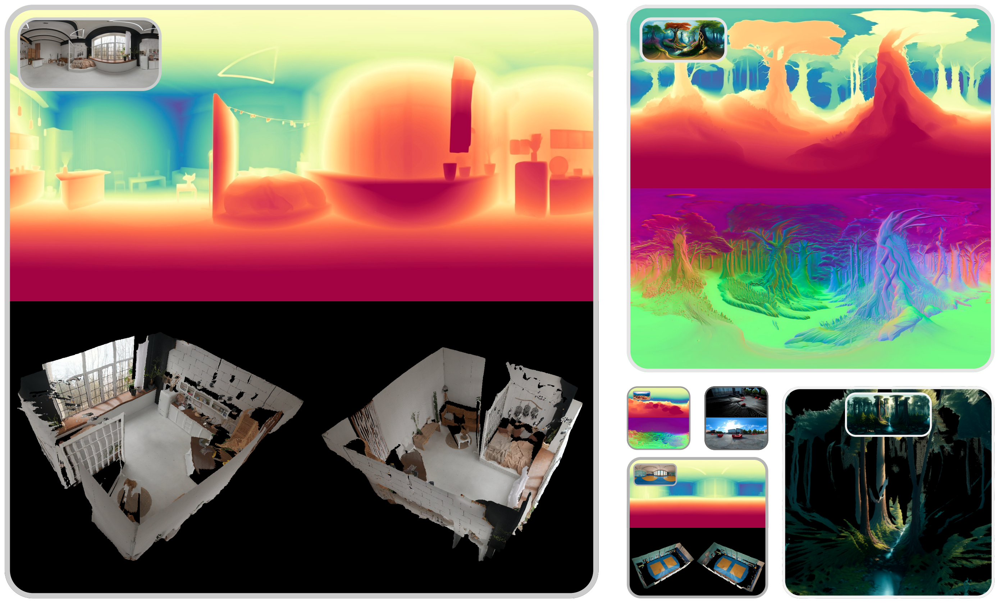

# 📟 PaGeR: Panorama Geometry Estimation using Single-Step Diffusion Models

This project implements **PaGeR**, a Computer Vision method for estimating geometry from monocular panoramic [ERP](https://en.wikipedia.org/wiki/Equirectangular_projection) images implemented in the paper **Panorama Geometry Estimation using Single-Step Diffusion Models**. 

[](website here)
[](paper here)
[](https://huggingface.co/spaces/prs-eth/PaGeR)
[](dataset link here)
[](https://huggingface.co/prs-eth/PaGeR-depth)
[](https://huggingface.co/prs-eth/PaGeR-normals)
[](https://huggingface.co/prs-eth/PaGeR-metric-depth)

Team:
[Vukasin Bozic](https://vulus98.github.io/),
[Isidora Slavkovic](https://www.linkedin.com/in/kevin-qu-b3417621b/),
[Dominik Narnhofer](https://scholar.google.com/citations?user=tFx8AhkAAAAJ&hl=en)
[Nando Metzger](https://nandometzger.github.io/),
[Denis Rozumny](https://rozumden.github.io/),
[Konrad Schindler](https://scholar.google.com/citations?user=FZuNgqIAAAAJ),
[Nikolai Kalischek](https://scholar.google.com/citations?user=XwzlnZoAAAAJ&hl=de)

We present **PaGeR**, a diffusion-based model for panoramic geometry reconstruction that extends monocular depth estimation to full 360° scenes. **PaGeR** is a one-step diffusion model trained directly in pixel space, capable of predicting high-resolution panoramic depth and surface normals with strong generalization to unseen environments. Leveraging advances in panorama generation and diffusion fine-tuning, **PaGeR** is trained on **PanoInfinigen**, a newly introduced synthetic dataset of indoor and outdoor scenes with metric depth and normals, producing coherent, metrically accurate geometry. It outperforms prior approaches across standard, few-shot, and zero-shot scenarios.




## 📢 News
05-02-2026: Full training, inference, and evaluation code added, along with the [arXiv paper](https://arxiv.org/abs/2312.02145), [interactive demo](https://huggingface.co/spaces/prs-eth/PaGeR) and [depth](https://huggingface.co/prs-eth/PaGeR-depth), [metric depth](https://huggingface.co/prs-eth/PaGeR-depth) and [normals](https://huggingface.co/prs-eth/PaGeR-normals) model checkpoints. Full dataset release coming soon.

## 🚀 Usage

**There are several ways to interact with PaGeR**:

1. A quick start is to use our HF-hosted demo: 
<a href="https://huggingface.co/spaces/prs-eth/PaGeR"></a> 

2. Run the demo locally (requires a 24VRAM GPU) -> see instructions below. 

3. Some interactive examples are also available at our project page: <a href="insert link here"></a>

4. Finally, local development instructions with this codebase are given below.

## 🛠️ Setup

The code was tested on:

-  Debian GNU/Linux 12, Python 3.10.16,  PyTorch 2.2.0, and CUDA 12.1.

### 📦 Repository

Clone the repository (requires git):

```bash
git clone https://github.com/prs-eth/PaGeR.git
cd PaGeR
```

### 💻 Dependencies

Create the Conda environment and install the dependencies:

```bash
conda env create -f environment.yaml
```

### 🏁 Prepare the checkpoints

The model checkpoints are hosted on Hugging Face:
- Depth: [prs-eth/PaGeR-depth](https://huggingface.co/prs-eth/PaGeR-depth)
- Metric Depth: [prs-eth/PaGeR-metric-depth](https://huggingface.co/prs-eth/PaGeR-metric-depth)
- Normals: [prs-eth/PaGeR-normals](https://huggingface.co/prs-eth/PaGeR-normals)
You can either download them automatically by specifying the HF checkpoint name in the arguments, or download them manually and load from a local path. If you choose the latter, please preserve the original folder structure, as in the Hugging Face repository.

### 📥 Download the datasets

For training, testing or evaluation, you would need to choose and download one or more of the following datasets:
- [PanoInfinigen(coming soon)]()
- [Matterport3D360](https://researchdata.bath.ac.uk/1126/)
- [Stanford2D3DS](https://sdss.redivis.com/datasets/f304-a3vhsvcaf)
- [Scannet++](https://scannetpp.mlsg.cit.tum.de/scannetpp/)
- [Structured3D](https://structured3d-dataset.org/)
- [Replica360_4K](https://github.com/iszihan/replica-dataset)

For download instructions, terms of use, and dataset description, please refer to the webpages of the respective datasets.
We provide the dataloaders for all of these datasets. You just need to choose the respective dataset in the config file or command line argument.

## 📷 Local Gradio Demo

The easiest way to test PaGeR locally is to run the Gradio demo. Make sure you have installed the dependencies as described above, then run:

```bash
python app.py
``` 
Now you can test the model, explore interactive 3D visualizations on both provided examples and your own images, or download the results.

## 🔧 Configuration settings
We use [OmegaConf](https://omegaconf.readthedocs.io/en/2.3_branch/) and [argparse](https://docs.python.org/3/library/argparse.html) for configuration management in all our scripts and models. The parameters for running the script could be influenced by either setting it in the config script, or directly providing a parameter in the CLI. The latter will always take precedence. Note that the model loading parameters will always be loaded from a YAML config file stored along with the model checkpoint, and they won't be overwritten by the local config or CLI args. 

## 🚀 Run inference

If you want to test models in the regular inference regime
```bash
# Depth
python inference.py \
    --configs "path/to/config" \
    --checkpoint_path "path/to/checkpoint" \
    --enable_xformers \
    --data_path "path/to/dataset" \
    --dataset "dataset-choice" \
    --results_path "path/to/save/results" \
    --pred_only \
```

TODO: generate_point_cloud explanation

### ⚙️ Inference settings

The behavior of the code can be customized in the following ways:

| Argument | Description |
|--------|-------------|
| `config` | Path to the YAML configuration file. |
| `checkpoint_path` | Model checkpoint to load (local path or HuggingFace repo ID). |
| `results_path` | Output directory where predictions are saved. |
| `dataset` | Dataset to use (list given above). |
| `data_path` | Root directory of the dataset. |
| `scenes` | Scene type to use: `indoor`, `outdoor`, or `both` (if supported). |
| `img_report_frequency` | Save an example output image every **N** samples. |
| `pred_only` | Save only the prediction image (otherwise saves an RGB + prediction mosaic). |
| `generate_eval` | Save predictions as `.npz` files for later evaluation. |
| `enable_xformers` | Enable memory-efficient attention (**recommended**). |


## 📊 Run Evaluation (for academic comparisons)

In order to run evaluation of inference results of our (or some other) model with the standard set of depth estimation [metrics](https://huggingface.co/blog/Isayoften/monocular-depth-estimation-guide)

```bash
# Depth
python evaluation/depth_evaluation.py \
    --pred_path "path/to/preds/folder" \
    --data_path "path/to/dataset" \
    --dataset "dataset-choice" \
    --alignment_type "alignment-type-to-apply" \
    --save_error_maps
```

Evaluation of the surface normal estimation could be done, similar to the [PanoNormal](https://arxiv.org/html/2405.18745v1) paper, by running the following command:

```bash
# Normals
python evaluation/normal_estimation.py \
    --pred_path "path/to/preds/folder" \
    --data_path "path/to/dataset" \
    --dataset "dataset-choice" \
    --alignment_type "alignment-type-to-apply" \
    --save_error_maps
```

```bash
# Edges
python script/iid/run.py \
    --checkpoint prs-eth/marigold-iid-appearance-v1-1 \
    --denoise_steps 4 \
    --ensemble_size 1 \
    --input_rgb_dir input/in-the-wild_example \
    --output_dir output/in-the-wild_example
```

### Evaluation Settings

The behavior of the code can be customized in the following ways:

| Argument | Type | Choices | Description |
|--------|------|--------|-------------|
| `--data_path` | `str` | – | Root directory of the dataset containing ground-truth depth and metadata. |
| `--dataset` | `str` | `PanoInfinigen`, `Matterport3D360`, `Stanford2D3DS`, `Structured3D`, `Structured3D_ScannetPP` | Dataset to evaluate on. Use `PanoInfinigen` for the synthetic dataset. |
| `--pred_path` | `str` | – | Directory containing the predicted depth maps to be evaluated. |
| `--alignment_type` | `str` | `metric`, `scale`, `scale_and_shift` | Alignment strategy applied between prediction and ground truth before evaluation. |
| `--save_error_maps` | `flag` | – | If set, saves per-sample error maps during evaluation. |
| `--error_maps_saving_frequency` | `int` | – | Frequency (in number of batches) at which error maps are saved. |

---

## 🏋🏻 Run training 

## 🦿 Evaluation on test datasets <a name="evaluation"></a>
Install additional dependencies:

```bash
pip install -r requirements+.txt -r requirements.txt
``` 

Set data directory variable (also needed in evaluation scripts) and download the evaluation datasets ([depth](https://share.phys.ethz.ch/~pf/bingkedata/marigold/evaluation_dataset), [normals](https://share.phys.ethz.ch/~pf/bingkedata/marigold/marigold_normals/evaluation_dataset)) into the corresponding subfolders:

```bash
export BASE_DATA_DIR=<YOUR_DATA_DIR>  # Set target data directory

# Depth
wget -r -np -nH --cut-dirs=4 -R "index.html*" -P ${BASE_DATA_DIR} https://share.phys.ethz.ch/~pf/bingkedata/marigold/evaluation_dataset/

# Normals
wget -r -np -nH --cut-dirs=4 -R "index.html*" -P ${BASE_DATA_DIR} https://share.phys.ethz.ch/~pf/bingkedata/marigold/marigold_normals/evaluation_dataset.zip
unzip ${BASE_DATA_DIR}/evaluation_dataset.zip -d ${BASE_DATA_DIR}/
rm -f ${BASE_DATA_DIR}/evaluation_dataset.zip
```
For download instructions of the intrinsic image decomposition test data, please refer to [iid-appearance instructions](script/iid/dataset_preprocess/interiorverse_appearance/README.md) and [iid-lighting instructions](script/iid/dataset_preprocess/hypersim_lighting/README.md). 

Run inference and evaluation scripts, for example:

```bash
# Depth
bash script/depth/eval/11_infer_nyu.sh  # Run inference
bash script/depth/eval/12_eval_nyu.sh   # Evaluate predictions
```

```bash
# Normals
bash script/normals/eval/11_infer_scannet.sh  # Run inference
bash script/normals/eval/12_eval_scannet.sh   # Evaluate predictions
```

```bash
# IID
bash script/iid/eval/11_infer_appearance_interiorverse.sh  # Run inference
bash script/iid/eval/12_eval_appearance_interiorverse.sh   # Evaluate predictions

bash script/iid/eval/21_infer_lighting_hypersim.sh  # Run inference
bash script/iid/eval/22_eval_lighting_hypersim.sh   # Evaluate predictions
```

```bash
# Depth (the original CVPR version)
bash script/depth/eval_old/11_infer_nyu.sh  # Run inference
bash script/depth/eval_old/12_eval_nyu.sh   # Evaluate predictions
```

Note: although the seed has been set, the results might still be slightly different on different hardware.

## 🏋️ Training

Based on the previously created environment, install extended requirements:

```bash
pip install -r requirements++.txt -r requirements+.txt -r requirements.txt
```

Set environment parameters for the data directory:

```bash
export BASE_DATA_DIR=YOUR_DATA_DIR        # directory of training data
export BASE_CKPT_DIR=YOUR_CHECKPOINT_DIR  # directory of pretrained checkpoint
```

Download Stable Diffusion v2 [checkpoint](https://huggingface.co/stabilityai/stable-diffusion-2) into `${BASE_CKPT_DIR}` ([backup link](https://share.phys.ethz.ch/~pf/bingkedata/marigold/checkpoint/stable-diffusion-2.tar))

### Prepare for training data
**Depth**

Prepare for [Hypersim](https://github.com/apple/ml-hypersim) and [Virtual KITTI 2](https://europe.naverlabs.com/research/computer-vision/proxy-virtual-worlds-vkitti-2/) datasets and save into `${BASE_DATA_DIR}`. Please refer to [this README](script/depth/dataset_preprocess/hypersim/README.md) for Hypersim preprocessing.

**Normals**

Prepare for [Hypersim](https://github.com/apple/ml-hypersim), [Interiorverse](https://interiorverse.github.io/) and [Sintel](http://sintel.is.tue.mpg.de/) datasets and save into `${BASE_DATA_DIR}`. Please refer to [this README](script/normals/dataset_preprocess/hypersim/README.md) for Hypersim preprocessing, [this README](script/normals/dataset_preprocess/interiorverse/README.md) for Interiorverse and [this README](script/normals/dataset_preprocess/sintel/README.md) for Sintel.

**Intrinsic Image Decomposition**

*Appearance model*: Prepare for [Interiorverse](https://interiorverse.github.io/) dataset and save into `${BASE_DATA_DIR}`. Please refer to [this README](script/iid/dataset_preprocess/interiorverse_appearance/README.md) for Interiorverse preprocessing.

*Lighting model*: Prepare for [Hypersim](https://github.com/apple/ml-hypersim) dataset and save into `${BASE_DATA_DIR}`. Please refer to [this README](script/iid/dataset_preprocess/hypersim_lighting/README.md) for Hypersim preprocessing.


### Run training script

```bash
# Depth
python script/depth/train.py --config config/train_marigold_depth.yaml
```

```bash
# Normals
python script/normals/train.py --config config/train_marigold_normals.yaml
```

```bash
# IID (appearance model)
python script/iid/train.py --config config/train_marigold_iid_appearance.yaml

# IID (lighting model)
python script/iid/train.py --config config/train_marigold_iid_lighting.yaml
```

Resume from a checkpoint, e.g.:

```bash
# Depth
python script/depth/train.py --resume_run output/marigold_base/checkpoint/latest
```

```bash
# Normals
python script/normals/train.py --resume_run output/train_marigold_normals/checkpoint/latest
```

```bash
# IID (appearance model)
python script/iid/train.py --resume_run output/train_marigold_iid_appearance/checkpoint/latest

# IID (lighting model)
python script/iid/train.py --resume_run output/train_marigold_iid_lighting/checkpoint/latest
```

### Compose checkpoint:
Only the U-Net and scheduler config are updated during training. They are saved in the training directory. To use the inference pipeline with your training result:
- replace `unet` folder in Marigold checkpoints with that in the `checkpoint` output folder.
- replace the `scheduler/scheduler_config.json` file in Marigold checkpoints with `checkpoint/scheduler_config.json` generated during training.
Then refer to [this section](#evaluation) for evaluation.

**Note**: Although random seeds have been set, the training result might be slightly different on different hardwares. It's recommended to train without interruption.

## ✏️ Contributing

Please refer to [this](CONTRIBUTING.md) instruction.

## 🎓 Citation

Please cite our paper:

```bibtex
Put citations here
```

## 🎫 License

This code of this work is licensed under the Apache License, Version 2.0 (as defined in the [LICENSE](LICENSE.txt)).

The models are licensed under RAIL++-M License (as defined in the [LICENSE-MODEL](LICENSE-MODEL.txt))

By downloading and using the code and model you agree to the terms in [LICENSE](LICENSE.txt) and [LICENSE-MODEL](LICENSE-MODEL.txt) respectively.

## Acknowledgements

This project builds upon and is inspired by the following repositories and works:

- [Marigold-e2e-ft](https://github.com/VisualComputingInstitute/diffusion-e2e-ft), based on paper [Fine-Tuning Image-Conditional Diffusion Models is Easier than You Think](https://arxiv.org/abs/2409.11355).
- [Marigold](https://github.com/prs-eth/Marigold/tree/main), based on paper [Repurposing Diffusion-Based Image Generators for Monocular Depth Estimation](https://arxiv.org/abs/2312.02145).

We thank the authors and maintainers for making their code publicly available.
