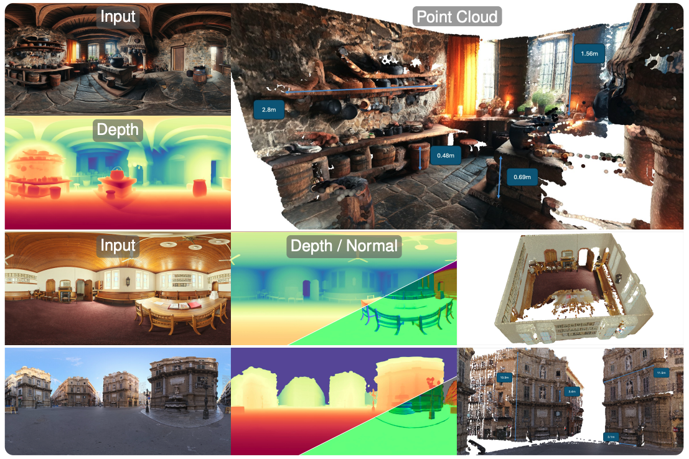

<div align="center">

<h1>📟 PaGeR — Unified Panoramic Geometry Estimation via Multi-View Foundation Models</h1>

<p>
  <a href="https://arxiv.org/abs/2605.26368"></a>
  <a href="https://pager360.github.io/"></a>
  <a href="https://huggingface.co/spaces/prs-eth/PaGeR"></a>
  <a href="https://huggingface.co/collections/prs-eth/pager-697241d06b3733a6f18e4d39"></a>
  <a href="https://huggingface.co/datasets/prs-eth/ZuriPano"></a>
  <a href="https://huggingface.co/datasets/prs-eth/PanoInfinigen"></a>
  <a href="LICENSE"></a>
  <a href="LICENSE-MODEL"></a>
</p>



</div>

PaGeR (**Pa**noramic **Ge**ometry **R**econstruction) lifts a perspective 3D
foundation model to the 360° panoramic domain. From a single equirectangular
image, a single forward pass returns:

- **Scale-invariant depth** at full panoramic resolution.
- **Metric depth** in metres — recovered by multiplying the SI depth by a
  single per-panorama scale emitted by a separate scale head; PaGeR
  ships two such heads (indoor / outdoor) and the inference pipeline picks
  one per panorama via a CLIP router.
- **Surface normals** as unit vectors in the world frame of the panorama.
- **Sky segmentation** for masking unbounded depth regions.

This repository contains the **inference and evaluation code** that produced
the numbers in our paper, plus a Gradio demo and helpers to export the
predicted geometry as a coloured point cloud.

## Release status

- **2026-05-27** — arXiv preprint and project website go live.
- **2026-05-26** — code, three pretrained checkpoints (`prs-eth/PaGeR`,
  `prs-eth/PaGeR-metric-depth`, `prs-eth/PaGeR-normals`) and both datasets
  (`prs-eth/ZuriPano`, `prs-eth/PanoInfinigen`) are live on the Hub.

---

## Table of contents

- [Release status](#release-status)
- [Installation](#installation)
- [Pretrained models](#pretrained-models)
- [Gradio demo](#gradio-demo)
- [Batch inference](#batch-inference)
- [Evaluation](#evaluation)
- [Point-cloud export](#point-cloud-export)
- [Citation](#citation)
- [License](#license)

---

## Installation

PaGeR is tested with **Python 3.10**, **PyTorch ≥ 2.0**, and **CUDA ≥ 12.1**
on Linux. Other configurations likely work; these are the ones we run in CI.
PaGeR always projects the input panorama into a fixed **6 × 504 × 504**
cubemap before the forward pass, regardless of the input ERP resolution, so
peak VRAM and runtime do not scale with the input size (only the final
cubemap-to-ERP stitch does). At that fixed resolution the unified checkpoint
(backbone + depth/normals/sky/scale heads + CLIP router) needs
**≈ 11.5 GiB of VRAM** at `fp16` on an RTX 4090, so any 3090 / 4090 /
A4000-class GPU with ≥ 12 GB is enough; the depth-only and normals-only
checkpoints fit in ≈ 9.8 GiB.

```bash
git clone https://github.com/prs-eth/PaGeR.git
cd PaGeR

# Editable install — exposes `depth_anything_3` as an importable package so
# the backbone's internal absolute imports resolve. The rest of the code
# (Pager, dataloaders, eval scripts) is run directly from the repo root.
pip install -e .

# Gradio demo (optional)
pip install -e ".[app]"
```

If you hit XFormers wheel issues on older GPUs, see
[the upstream FAQ](https://github.com/facebookresearch/xformers) for build
instructions.

## Pretrained models

Three checkpoints on the Hub, same ViT-Giant backbone, different heads:

| Checkpoint | `--checkpoint` alias | SI depth | Metric depth | Normals | Sky |
|---|---|---|---|---|---|
| **PaGeR** *(recommended)* — [`prs-eth/PaGeR`](https://huggingface.co/prs-eth/PaGeR) | `pager` | ✅ | ✅ (SI × CLIP-routed indoor / outdoor scale head) | ✅ | ✅ |
| PaGeR-Metric-Depth — [`prs-eth/PaGeR-metric-depth`](https://huggingface.co/prs-eth/PaGeR-metric-depth) | `pager-metric-depth` | — | ✅ (single direct head) | — | — |
| PaGeR-Normals — [`prs-eth/PaGeR-normals`](https://huggingface.co/prs-eth/PaGeR-normals) | `pager-normals` | — | — | ✅ | — |

`inference.py` / `app.py` accept the alias, a Hub repo id, or a local
directory with `model.safetensors` + `config.yaml`; Hub weights are streamed
into the HF cache on first use.

> **Heads up — indoor / outdoor scale routing.** On the unified checkpoint,
> `--scene_mode auto` (default) runs a small CLIP ViT-B/32 classifier on the
> cubemap to route each panorama through the matching indoor / outdoor scale head;
> pass `--scene_mode indoor` or `outdoor` to force one head and reproduce
> the per-domain paper numbers. Note that the automatic CLIP-based indoor /
> outdoor routing was added **after** the paper submission — the paper
> numbers were produced with `--scene_mode indoor` / `outdoor` forced per
> dataset, so use those flags to exactly reproduce the reported results.

## Gradio demo

```bash
python app.py --checkpoint pager     # or prs-eth/PaGeR / a local dir
```

Open `http://127.0.0.1:7860` and drop a panorama into the file picker. The
demo includes example panoramas, switches between map and point-cloud
output, and exposes the same auto / indoor / outdoor scale-head routing as
the CLI. A hosted version is also available on the
[PaGeR HuggingFace Space](https://huggingface.co/spaces/prs-eth/PaGeR).

## Batch inference

`inference.py` runs the model on every panorama in a chosen evaluation
dataset and writes raw predictions plus side-by-side previews:

```bash
python inference.py \
    --config configs/inference.yaml \
    --checkpoint <model_name> \
    --data_path /path/to/datasets \
    --dataset <dataset_name> \
    --results_path results/ \
    --scene_mode auto \
    --generate_eval
```

Key flags:

- `--checkpoint` — which model to run. Accepts a short alias for one of the
  released checkpoints — `pager` (default,
  [`prs-eth/PaGeR`](https://huggingface.co/prs-eth/PaGeR)), `pager-metric-depth`
  ([`prs-eth/PaGeR-metric-depth`](https://huggingface.co/prs-eth/PaGeR-metric-depth)),
  `pager-normals` ([`prs-eth/PaGeR-normals`](https://huggingface.co/prs-eth/PaGeR-normals))
  — *or* a HuggingFace Hub repo id (`<user>/<repo>`) *or* a local directory
  containing `model.safetensors` + `config.yaml`.
- `--scene_mode {auto,indoor,outdoor}` — controls the scale-head routing. On
  the unified checkpoint `auto` is the default; on single-domain checkpoints
  this flag has no effect.
- `--generate_eval` — also write per-sample `.npz` arrays under
  `<results>/<modality>/preds/` so the evaluation scripts can pick them up.
- `--sky_mask_threshold`, `--sky_mask_softness`, `--sky_mask_open_kernel` —
  tune the soft sky-fill applied to the depth / normals outputs.

Expected dataset layout under `--data_path`:

```
<data_path>/
├── Matterport3D360/
├── Stanford2D3DS/
├── Structured3D/
└── Replica360_4K/
```

Download / access pages for each dataset:

| Dataset | Source | Use in PaGeR |
|---|---|---|
| [Matterport3D360](https://researchdata.bath.ac.uk/1126/) | re-projected from [Matterport3D](https://niessner.github.io/Matterport/) | eval only |
| [Stanford 2D-3D-S](https://sdss.redivis.com/datasets/f304-a3vhsvcaf) | Armeni et al., Stanford | eval only |
| [Replica360_4K](https://opendatalab.com/OpenDataLab/Replica_360_2k_4k_RGBD) | 4K equirectangular renders of [Replica](https://github.com/facebookresearch/replica-dataset) (Facebook Research) | eval only |
| [Structured3D](https://structured3d-dataset.org/) | Zheng et al. | training + eval (normals) |
| [ZüriPano](https://huggingface.co/datasets/prs-eth/ZuriPano) | released with PaGeR | eval |
| [PanoInfinigen](https://huggingface.co/datasets/prs-eth/PanoInfinigen) | released with PaGeR (Infinigen / iCity renders) | training |

The three eval-only datasets (Matterport3D360, Stanford2D3DS, Replica360_4K)
are gated behind the upstream EULAs; please obtain them from the linked
source pages. See [`NOTICE`](NOTICE) for the per-dataset licenses and
obligations, and each dataloader in [`dataloaders/`](dataloaders/) for the
exact on-disk layout it expects (image / depth / mask / normals naming).

## Evaluation

`evaluation/depth_evaluation.py` scores the cached depth predictions against
ground truth, on **Matterport3D360**, **Stanford2D3DS** or **ZuriPano**. Run
it once per dataset:

```bash
# Metric depth (in-metres, no alignment).
python evaluation/depth_evaluation.py \
    --data_path /path/to/datasets \
    --dataset <dataset-name> \
    --pred_path results \
    --alignment_type metric

# Scale-invariant depth (least-squares scale alignment).
python evaluation/depth_evaluation.py \
    --data_path /path/to/datasets \
    --dataset <dataset-name> \
    --pred_path results \
    --alignment_type scale
```

Reported metrics: **AbsRel**, **RMSE (linear)**, **δ₁**, averaged uniformly
over the valid ERP pixels. Results land in
`<pred_path>/depth/evaluation_metrics_<alignment>.txt`.

For surface normals on Structured3D:

```bash
python evaluation/normals_evaluation.py \
    --data_path /path/to/datasets \
    --dataset Structured3D \
    --pred_path results
```

To quantify cubemap-stitching artefacts in the depth predictions (Table 4a in
the paper) on **Replica360_4K**:

```bash
python evaluation/seams_evaluation.py \
    --data_path /path/to/datasets \
    --dataset Replica360_4K \
    --pred_path results
```

Reports the three metrics `seam_defect_density`, `seam_prevalence`,
`seam_severity` — see the appendix of our paper for the exact definitions.

## Point-cloud export

```bash
python generate_point_cloud.py \
    --data_path /path/to/datasets \
    --dataset <dataset-name> \
    --depth_path results \
    --color_modality rgb \
    --max_points 1000000
```

GLBs land under `<depth_path>/depth/point_clouds/` (or
`<depth_path>/normals/point_clouds/` when colouring by predicted normals).
Pass `--color_modality normals` to colour by predicted normals.

## Citation

If you use PaGeR, the released checkpoints, or the ZüriPano / PanoInfinigen
datasets in your work, please cite:

```bibtex
@article{bozic2026pager,
  title   = {Unified Panoramic Geometry Estimation via Multi-View Foundation Models},
  author  = {Bozic, Vukasin and Slavkovic, Isidora and Narnhofer, Dominik and
             Metzger, Nando and Rozumny, Denis and Schindler, Konrad and
             Kalischek, Nikolai},
  journal = {arXiv preprint arXiv:2605.26368},
  year    = {2026}
}
```

## License

PaGeR is released under **three separate licenses**, one per artifact
class, because the training and modeling stack is not uniform.

| Artifact | License | File |
|---|---|---|
| **Source code** (this repository) | [Apache License 2.0](LICENSE) | `LICENSE` |
| **Pretrained model weights** (HuggingFace `prs-eth/PaGeR*`) | [CC BY-NC 4.0](https://creativecommons.org/licenses/by-nc/4.0/) — academic / non-commercial only | `LICENSE-MODEL` |
| **ZüriPano dataset** | [CC BY 4.0](https://creativecommons.org/licenses/by/4.0/) | (on the dataset HF repo) |
| **PanoInfinigen — nature split** | [BSD 3-Clause](https://opensource.org/license/bsd-3-clause) (inherited from Infinigen) | (on the dataset HF repo) |
| **PanoInfinigen — indoor split** | [BSD 3-Clause](https://opensource.org/license/bsd-3-clause) (inherited from Infinigen) | (on the dataset HF repo) |
| **PanoInfinigen — urban split** | [CC BY-NC 4.0](https://creativecommons.org/licenses/by-nc/4.0/) (iCity-encumbered) | (on the dataset HF repo) |

The non-commercial restriction on the weights is inherited from the
[Depth Anything 3](https://github.com/ByteDance-Seed/Depth-Anything-3)
ViT-Giant backbone (CC BY-NC 4.0) and from the non-commercial / research-only
terms of PanoInfinigen — urban subset. See [`NOTICE`](NOTICE) for the full
third-party attribution list and per-dataset breakdown.

## Acknowledgements

PaGeR builds on top of
[Depth Anything 3](https://github.com/ByteDance-Seed/Depth-Anything-3) —
the backbone and the multi-view inference code under
[`src/depth_anything_3/`](src/depth_anything_3/) are derived from that
project. The training script is adapted from
[Marigold-E2E-FT](https://github.com/VisualComputingInstitute/diffusion-e2e-ft).
The indoor/outdoor classifier uses OpenAI CLIP via
[`open_clip`](https://github.com/mlfoundations/open_clip).
